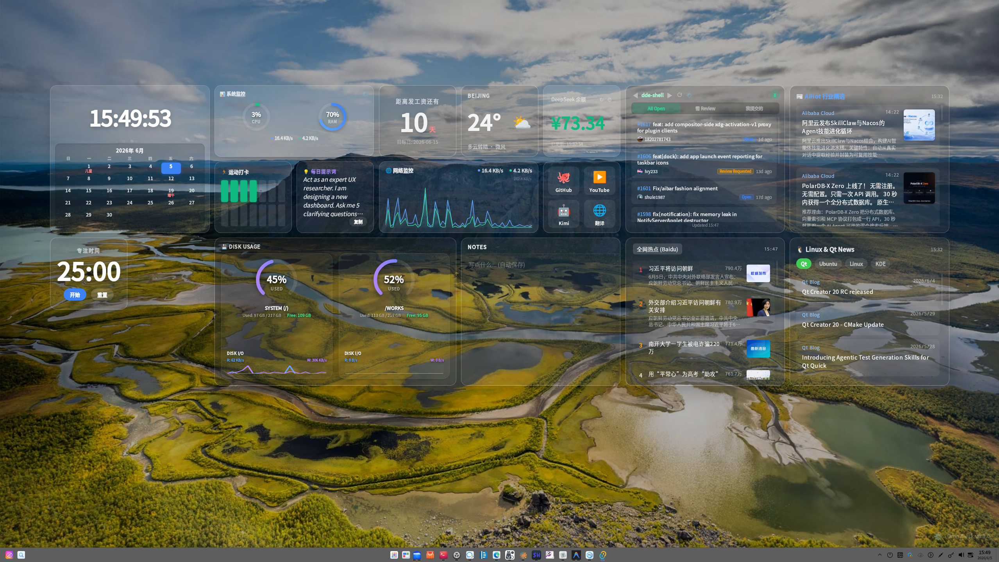

# 🌌 OmniDesk: The Ultimate Hacker Desktop Engine

<div align="center">
  
  <p><em>一个高度可定制、纯本地驱动、基于沙盒隔离的极客桌面微件引擎 (Widget Desktop Engine)</em></p>
</div>

OmniDesk 旨在打破传统桌面的枯燥与死板。通过 **Tauri 2.0 + Rust + React** 的强强联合，它允许你在桌面上挂载无限可能的生产力工具与信息面板。轻量、极速、无边无际。

---

## 📸 效果展示 (Showcase)

<div align="center">
  
</div>

---

## 🌟 核心特性 (Core Features)

- 🧩 **全自适应网格系统 (Adaptive Grid Engine)**：摆脱固定宽高比！支持任意拖拽、调整大小，组件间自动碰撞与避让，完美契合你的显示器分辨率，100% 榨干桌面空间。
- 🛡️ **沙盒架构 (Sandbox Isolation)**：每一个 Widget 都在独立的 `iframe` 中运行，互相绝对隔离，彻底杜绝全局 CSS/JS 污染，甚至支持完全不同的技术栈混编！
- 🌐 **底层网络穿透 (CORS-Free Proxy)**：通过 Rust 封装的跨域代理，前端 Widget 可以无视浏览器的 CORS 限制，直击接口，轻松抓取全网数据。
- 🎬 **动态航拍壁纸引擎 (Continuous Streaming Engine)**：内置 Apple TV 官方超清航拍库。采用纯在线流媒体无限轮播模式，配合 WebKitGTK 硬件加速底层优化，0 带宽抢占，纵享世界级航拍大片。
- 🎨 **极致的毛玻璃美学 (Glassmorphism)**：专门为现代混合器 (Compositors) 优化的暗黑模式与高级背景实时模糊效果，每一帧都是壁纸级别。
- 💾 **系统级文件持久化 (Local Persistence)**：提供沙盒级的文件读写接口，让 Widget 都能安全、持久地将用户的隐私配置（如 API Token）保存在系统物理硬盘中。
- 🧘 **禅模式 (Zen Mode)**：在桌面空白处双击鼠标，可通过平滑渐隐动画一键隐藏所有组件及遮罩，瞬间进入沉浸式赏图模式。
- 🖱️ **沉浸式右键设置菜单**：随叫随到的高斯模糊设置中心，自由定制你的专属桌面、微件排列与壁纸。

## 📦 内置高阶微件 (Pre-built Widgets)

- **GitHub PR Monitor**：多仓库自动轮播，基于 PAT 防限流，实时掌握团队进度。
- **全网实时热点**：基于底层爬虫解析，抓取全网（百度/微博等）实时热搜，绝不错过任何大瓜。
- **System Monitor**：车载仪表盘级别的双圆环仪表盘，实时呈现 CPU & RAM 占用率与网络带宽吞吐。
- **Disk IO Widget**：赛博朋克风格磁盘读写监控。
- **其他精选微件**：AI 行业快讯聚合、天气、Pomodoro 番茄钟、快捷指令等。

## 🛠️ 技术栈 (Tech Stack)

- **核心框架**: [Tauri 2.0](https://tauri.app/) (极限的低内存占用与系统原生能力)
- **后端架构**: Rust (`reqwest` 代理, `sysinfo` 系统探针)
- **前端渲染**: React 18 + TypeScript + Vite
- **视觉构建**: Vanilla CSS + 原生 SVG 计算交互

## 🚀 快速启动 (Getting Started)

### 环境要求
- Node.js >= 18
- Rust 工具链 (`rustup`, `cargo`)
- Linux 系统依赖 (如 `libwebkit2gtk-4.1-dev`)

### 运行步骤
```bash
# 1. 安装前端依赖
npm install

# 2. 启动开发服务器与 Rust 后端
npm run tauri dev
```

## 📂 项目结构指南

- `src-tauri/src/lib.rs`：核心的 Rust 业务逻辑，包含 HTTP Proxy、文件系统挂载与监控数据采集。
- `src/components/GridEngine.tsx`：自适应网格排版系统核心计算引擎。
- `src/App.tsx`：桌面的主入口、路由与状态分发中枢。
- `public/widgets/`：**所有 Widget 的生态老巢！** 
  > 想要开发一个新组件？只需要在这里新建一个文件夹，放入 `manifest.json` 和 `index.html`，即刻获得全套的底层系统能力，无需重新编译主程序即可热插拔生效！

## 📝 License
MIT License
